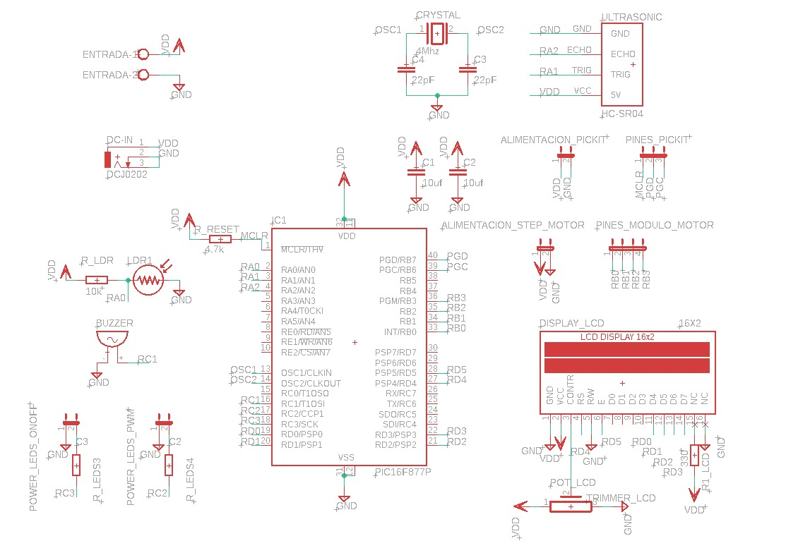
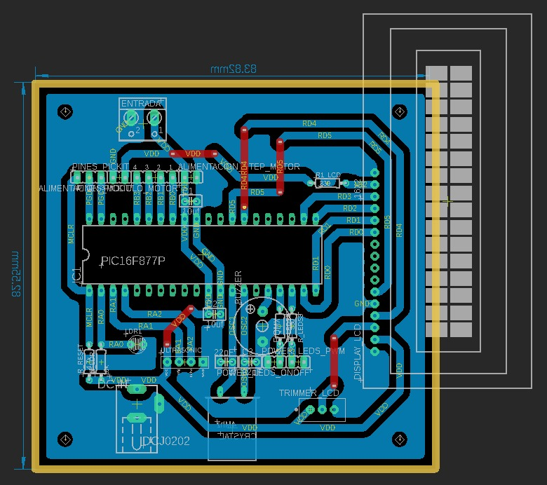
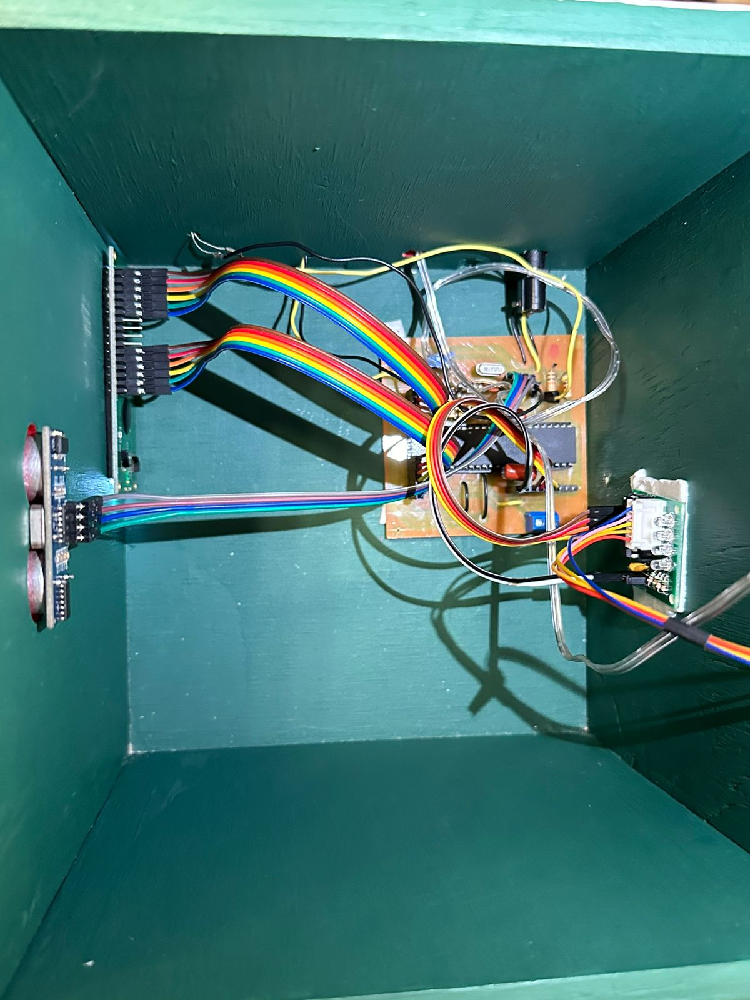

# Final Project Microcontrollers  
- [Spanish](./README_es.md) 

> **IMPORTANT**: This project was born from the idea of creating a Christmas-themed box, equipped with electronics, as part of the final project for the Microcontrollers course (November 2024).  

## Project Description  
The project consists of an interactive Christmas box, controlled by a **PIC16F877A** microcontroller, designed to combine creativity, electronics, and programming into a single functional device.  

## Roles and Tools Used  

### Roles  
The team is composed of:  
- **Orlando Arroyo**  
- **María López**  
- **Andrés Fábregas**  

All members participated in various roles, including:  
- Software and hardware development.  
- Product management.  
  

### Tools  
- **Notion**: For task assignment and progress tracking.  
- **MPLAB X IDE v5.35** and **XC8 v2.5**: For microcontroller programming.  
- **Autodesk EAGLE**: For schematic and PCB design.  

## System Operation  

Once powered on, the system displays an **initial Christmas message** on the LCD screen. From this point, the LDR sensor evaluates light conditions to determine if it is day or night, activating one of the following modes:  

### **Night Mode**  
- A decorative light is turned on.  
- A themed message is displayed on the LCD screen.  

### **Day Mode**  
In this mode, the system uses an ultrasonic sensor to detect the proximity of an object or person. If presence is detected, the following functions are activated:  
1. **Stepper motor**: Rotates a decorative figure.  
2. **Speaker**: Plays a Christmas melody.  
3. **LED strip**: Blinks in sync with the music using PWM.  
4. **LCD screen**: Displays a message related to the current activity.  

## PIC16F877A Resource Allocation  

The system utilizes the resources of the **PIC16F877A** microcontroller as follows:  

- **Port D**: Controls the LCD screen (RD0 to RD5 as outputs).  
- **Port B**: Controls the stepper motor (RB0 to RB3 as outputs).  
- **Port A**: Manages the sensors:  
  - **RA0**: Analog input for the LDR sensor.  
  - **RA1 and RA2**: Controls the ultrasonic sensor:  
    - **RA1 (Trigger)**: Output.  
    - **RA2 (Echo)**: Input.  
- **Port C**: Controls the speaker and LED strip.

## Schematic and PCB Design  

Using **Autodesk EAGLE**, we designed both the schematic and the system's PCB. These designs can be viewed in the images available in the `img` folder:  
- **Schematic**:   
- **PCB**: 

## Final Circuit of the System  

After soldering all the components onto the PCB, this is the final result of the circuit, assembled inside the box:  
- **PCB Circuit**:   

## Final Result  

After decorating the box with a Christmas style, this was the final result of the project:  
- **Photo of the Final Project**:   
- **Functionality Video**: [Watch Video](./img/resultado_final.mp4)  
