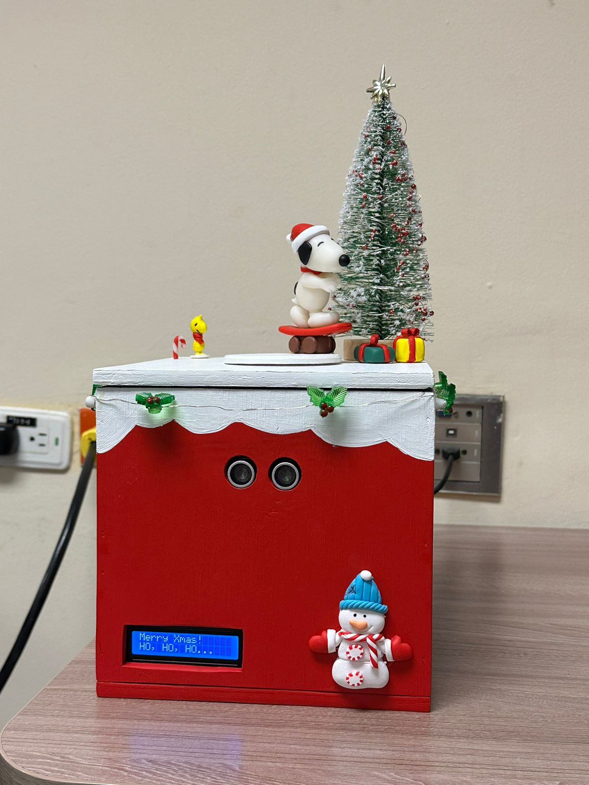

# Proyecto Final Microcontroladores  

> **IMPORTANTE**: Este proyecto nace de la idea de crear una caja con temática navideña, equipada con electrónica, como parte del proyecto final de la asignatura de Microcontroladores (Noviembre 2024).  

## Descripción del Proyecto  
El proyecto consiste en una caja navideña interactiva, controlada mediante un microcontrolador **PIC16F877A**, diseñada para combinar creatividad, electrónica y programación en un solo dispositivo funcional.  

## Roles y Herramientas Utilizadas  

### Roles  
El equipo está compuesto por:  
- **Orlando Arroyo**  
- **María López**  
- **Andrés Fábregas**  

Todos los integrantes participaron en diversos roles, incluyendo:  
- Desarrollo de software y hardware.  
- Gestión de producto.  
  

### Herramientas  
- **Notion**: Para la asignación de tareas y el seguimiento del progreso.  
- **MPLAB X IDE v5.35** y **XC8 v2.5**: Para la programación del microcontrolador.  
- **Autodesk EAGLE**: Para el diseño del esquema y la PCB.  

## Funcionamiento del Sistema

Una vez encendido, el sistema despliega un **mensaje navideño inicial** en la pantalla LCD. A partir de este momento, el sensor LDR evalúa las condiciones de luz para determinar si es de día o de noche, activando uno de los siguientes modos:  

### **Modo Noche**  
- Se enciende una luz decorativa.  
- Se muestra un mensaje alusivo en la pantalla LCD.  

### **Modo Día**  
En este modo, el sistema utiliza un sensor ultrasónico para detectar la proximidad de un objeto o persona. Si se detecta presencia, se activan las siguientes funciones:  
1. **Motor paso a paso**: Hace girar una figura decorativa.  
2. **Altavoz**: Reproduce una melodía navideña.  
3. **Tira de LEDs**: Parpadea al ritmo de la música, sincronizada mediante PWM.  
4. **Pantalla LCD**: Muestra un mensaje relacionado con la actividad en curso.  

## Distribución de Recursos del PIC16F877A  

El sistema utiliza los recursos del microcontrolador **PIC16F877A** de la siguiente manera:  

- **Puerto D**: Control de la pantalla LCD (RD0 a RD5 como salidas).  
- **Puerto B**: Control del motor paso a paso (RB0 a RB3 como salidas).  
- **Puerto A**: Manejo de sensores:  
  - **RA0**: Entrada analógica para el sensor LDR.  
  - **RA1 y RA2**: Control del sensor ultrasónico:  
    - **RA1 (Trigger)**: Salida.  
    - **RA2 (Echo)**: Entrada.  
- **Puerto C**: Control del altavoz y la tira de LEDs.

## Diseño del Esquemático y PCB  

Utilizando **Autodesk EAGLE**, diseñamos tanto el esquemático como la PCB del sistema. Estos diseños pueden visualizarse en las imágenes disponibles en la carpeta `img`:  
- **Esquemático**:   
- **PCB**: 

## Circuito Final del Sistema  

Luego de soldar todos los componentes en la PCB, este es el resultado final del circuito, ensamblado dentro de la caja:  
- **Circuito PCB**:   

## Resultado Final  

Tras decorar la caja con un estilo navideño, este fue el resultado final del proyecto:  
- **Foto del Proyecto Final**:   
- **Video del Funcionamiento**: [Ver Video](./img/resultado_final.mp4)  

